# Preambulo

## Quien soy?

Gabriel Muñoz 

- Biólogo
- Ecólogo Computacional 

Consultor en Datos 

*Biodiversidad y Geoespaciales*

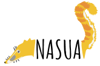

## Charla Introductoria 

Talleres participativos 

Aprender herramientas de manera práctica 

22,23 de Marzo.

MediaLAB

# Datos

## Mundo de Datos

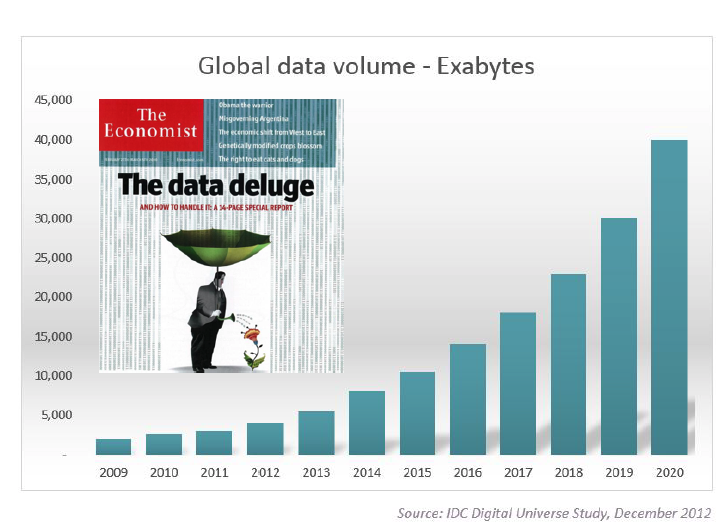


## Mundo de Datos

- [Contar Historias](http://www.elcomercio.com/datos/pichincha-tasa-autos-personas-vehiculos.html)
- [Comunicar Ideas](https://www.cloudred.com/labprojects/nyctrees/#about)
- [Entender el Mundo](https://ourworldindata.org/)

## Datos tienen Valor

<div id="right">

*Valor agregado*

- Inversión en tiempo

- Inversión en conocimiento

*Curación de datos*

- Organización e Integración de Datos Heterogeneos

  **Human readable** ---> **Machine readable** ---> **Human readable**
</div>

<div id="left">


</div>

# Manejo Hábil de Datos

## De que se trata? 

Desarrollar habilidades


*y aprender herramientas...*

## Ciclo de vida de los Datos

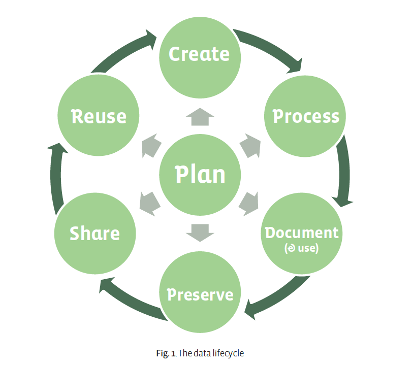

## Creación (*Obtención y Descubrimiento*)

<div id="left">

- que ya existe? 

- Open Databases


</div>

<div id="right">


[openDOAR](http://www.opendoar.org/countrylist.php?cContinent=South%20America)-
[GBIF](https://www.gbif.org/dataset/search?q=ecuador)-
[DataVerse](https://dataverse.harvard.edu/dataverse/harvard?q=ecuador)-
[Ecuador en Cifras](http://www.ecuadorencifras.gob.ec/ecuador-en-cifras/)-
[re3data](https://www.re3data.org/search)-
[DataOne](https://search.dataone.org/index.html#data)-
[EOL](http://eol.org/)-
[Zenodo](https://zenodo.org/)-
[GapMinder](https://www.gapminder.org/data/)-
[WorldBank](https://data.worldbank.org/)

</div>

## Creación (*Obtención y Descubrimiento*)

<div id="left">
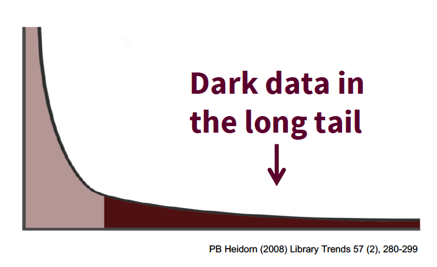
</div>

<div id="right">

Datos específicos son díficiles de encontrar, el resto inaccesible

- [GOOGLE it](https://support.google.com/websearch/answer/134479?hl=es)

- [GOOGLE it](https://www.google.com/search/howsearchworks/)

</div>

## Procesamiento

Datos heterogeneos, desordenados ("Messy Data")

Hojas de calculo

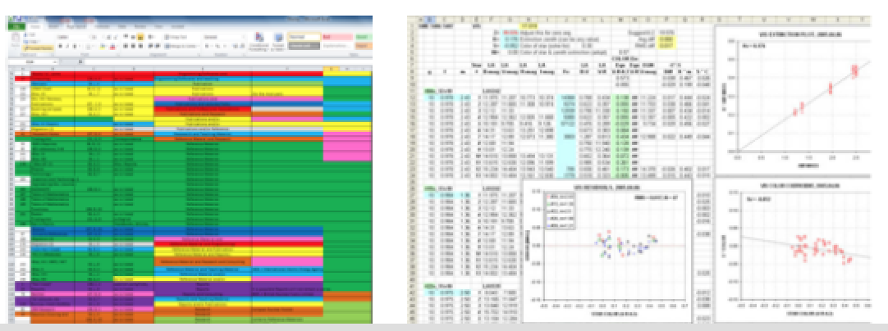


## Procesamiento

Datos heterogeneos, desordenados ("Messy Data")

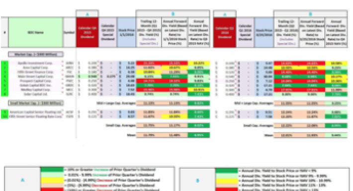 


## Procesamiento


## Procesamiento

Una Variable, Una Columna!!!!

## Procesamiento

Una Variable, Una Columna!!!!

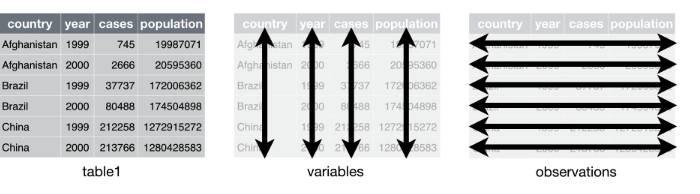

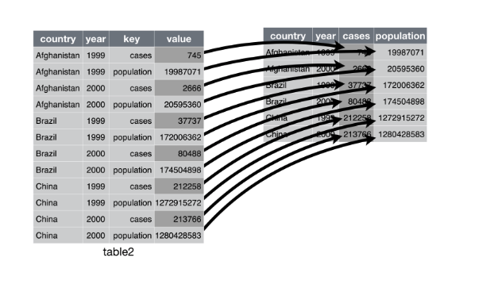

## Procesamiento

Pequeños problemas, grandes dolores de cabeza!

- Errores de tipeo 

- Discrepancias 

- Fueras de lugar

- Errores de formato

- Irregularidades

- Datos faltantes

## Procesamiento

Pequeños problemas, grandes dolores de cabeza!

- Contradicciones

- Duplicaciones

- Fueras de rango 

- Incongruencias

- Multiples valores

## Procesamiento (Soluciones)

- Aprender a usar codigo [R]() [tidyr, dplyr](https://github.com/rstudio/cheatsheets/raw/master/data-transformation.pdf)

- [tidyverse](https://www.tidyverse.org/)

- [GoogleOpenRefine](http://openrefine.org/)


## Ciclo de vida de los Datos


## Documentacion

Metadata a nivel del proyecto 

  - Objectivos
  - Personal 
  - Standards
  - Metodos de colecta de datos
  - Estructura y organización de los datos
  - Software usado
  - Como citar los datos
  - Propiedades intelectuales y licencias 
  

## Documentacion

Metadata a nivel de variables 

  - Nombres, etiquetas y descripción
  - Codigos, explicación de cada uno 
  - Acrónimos
  - Valores faltantes? Razones
  - Datos derivados del raw file
  
## Documentacion

Uso de software como R, mantiene la documentación de datos durante el proceso de análisis 

## Documentación del análisis 

Usa codigo (Scripts)

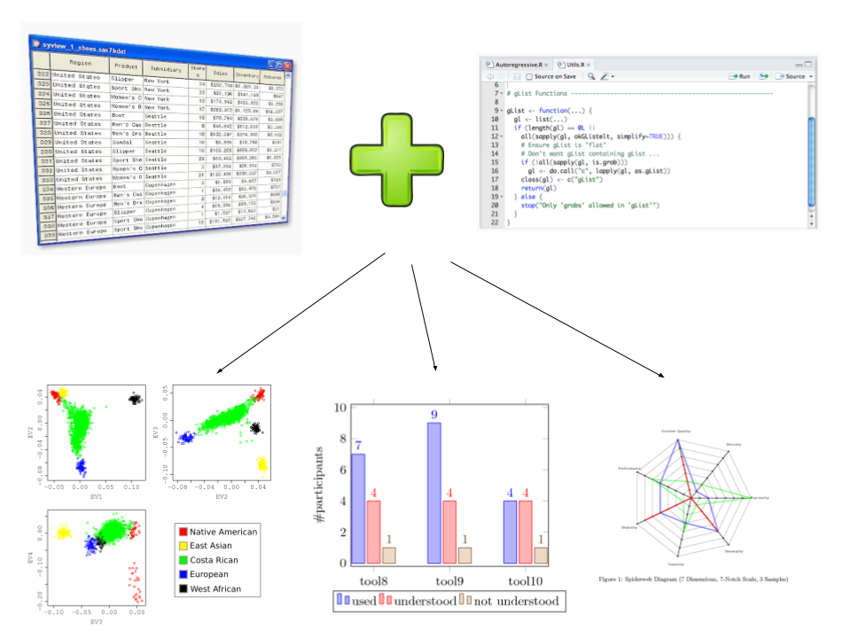

## Preserva, Comparte y Reusa 

- Registros similares en un dataset

- Seguir standards internacionales en unidades y formatos (e.g. yyyy-mm-dd)

- Se consistente (e.g. Mts, (m), metros)

- Preserva en formatos estables (.csv, .txt, TIFF)

## Preserva, Comparte y Reusa 

- Especificar coordenadas espaciales y temporales (e.g. UTM 17S, Geograficas)

- RawData as "ReadOnly" y comparte tus scripts

- Asegura la calidad de tus datos

- Provee Documentación

## Preserva, Comparte y Reusa 

- Protege tus datos (Original, Online, Offline)

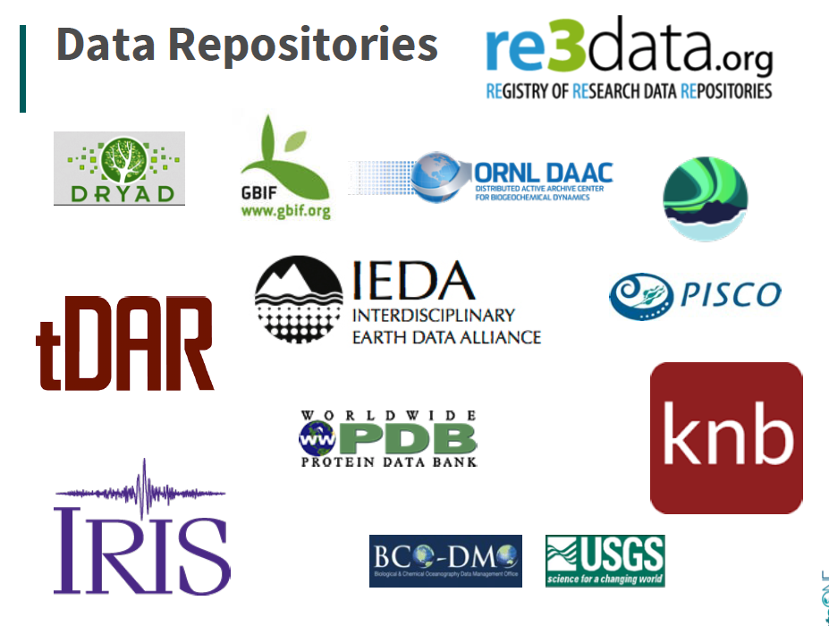

## Preserva, Comparte y Reusa 

- [ZENODO](https://zenodo.org/)

- [GitHub](https://github.com/dashboard/discover) *Personal favorite*

- [DataVerse](https://dataverse.org/)

# Ciencia Reproducible 

(Break?)

## Un proyecto, una carpeta

No te metas con el "raw data"


## Elige bien tus nombres

Bueno: 

- rawDatasetAgo2017.csv
- 01_figurasIntro.R
- 02_figurasResultados.R
- gastoPublicoViceprescidenciaGlass2016.csv
- datos_corrupción_Ecuador.csv


## Elige bien tus nombres

Malo: 

- 1.csv
- Archivo-Corregido.R
- asnbx.csv
- 1-4.csv
- download.csv
- No.separes.con.puntos.csv

## Elige bien tus nombres

Empieza listas con un 0

- 01
- 02
- 03
- ...
- 10

de lo contrario 

- 10
- 1
- 2
- 3
- .. 

## Un proyecto, una carpeta :) 

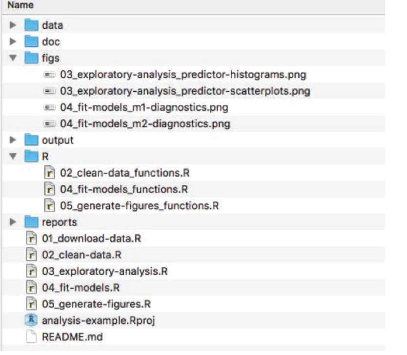

## Ahora si, a escribir código!

Herramientas 

- Abiertas

- Grátis!

- Poderosas 

- Gran Comunidad Mundial 

- Actualizables 

- Desarrollador --> Usuario

## Ahora si, a escribir código!

Lenguages de programación 

- [R](https://www.r-project.org/)
- [Python](https://www.python.org/)
- SQL
- Java
- Scala
- Julia
- Perl
- Ruby 
- C++ 
- Matlab

## R y R Studio 

- OpenSource
- Gratis

https://www.rstudio.com/products/rstudio/features/

## Buenas prácticas de programación 

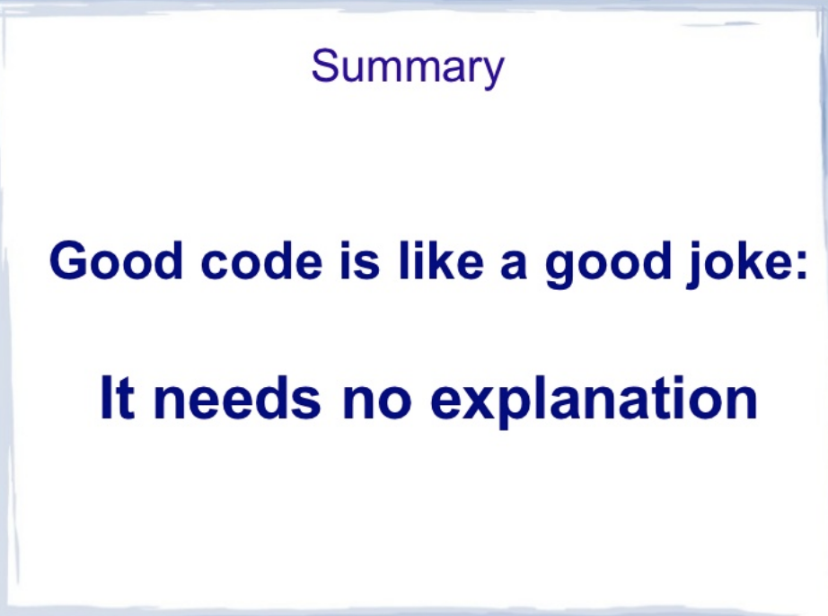

## Visualización estática

```{r, out.width="50%"}
plot(speed~dist, cars,
     xlab = "distancia",
     ylab = "Velocidad", 
     col = "blue",
     pch = 16,
     main = "Cars Dataset")
```

## Visualización dinámica

```{r, message=FALSE, out.height="40%", fig.align="center"}
library(plotly)
d <- diamonds[sample(nrow(diamonds), 500), ]
plot_ly(d, x = d$carat, y = d$price, 
        text = paste("Clarity: ", d$clarity),
        mode = "markers", color = d$carat, size = d$carat)
```

## Mas ejemplos

```{r, fig.align="center", echo = FALSE}
library(visNetwork)
nodes <- data.frame(id = 1:6, title = paste("node", 1:6), 
                    shape = c("dot", "square"),
                    size = 10:15, color = c("blue", "red"))
edges <- data.frame(from = 1:5, to = c(5, 4, 6, 3, 3))
visNetwork(nodes, edges) %>%
  visOptions(highlightNearest = TRUE, nodesIdSelection = TRUE)
```


## Markdown y reportes reproducibles

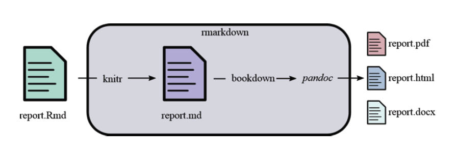

Maarkdown es un lenguaje simple, pero poderoso para crear publicaciones. Facil sintaxis que permite el formato y la inclusión de links, imagenes, referencias, en el texto. 


## Ejemplos: 

### Primer example
Una ecuación: `$A = \sin(x)^2*log(a)+25^{2}$`

Esto es código `this is code`

$A = \sin(x)^2*log(a)+25^{2}$

## Segundo ejemplo
Una imagen: `!(figs/copypaste.jpg)`

No máss copy - paste!
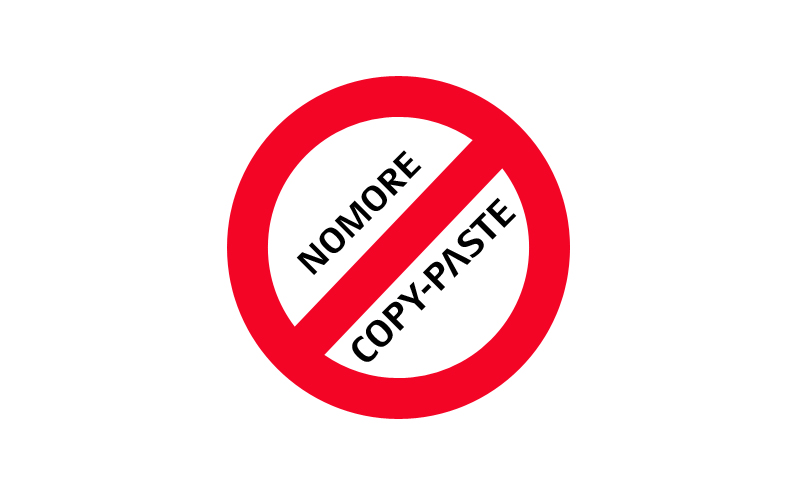  

## Tercer ejemplo: 

hypervinculo: `[GBIF](http://www.gbif.org/)`

Este el es link a la página del [GBIF](http://www.gbif.org/).

## Sintax general

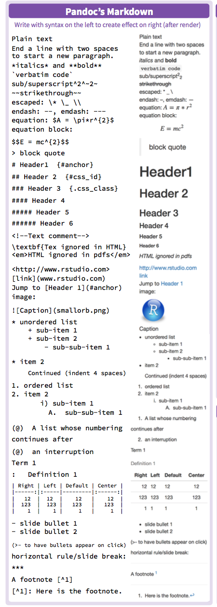

## Por que usar Rmarkdown? 

R Markdown te permite integrar tu codigo y flujo de analisis con texto escrito en sintaxis markdown.  Esto asegura que tus análisis sean reproducibles, interactivos, compartibles y agradables de visualizar al momento de reportar. Al mismo tiempo reduce el tiempo ocupado en escribir y **Formatear** reporters. Tareas manuales como enumerar figuras, bibliografía, formatos de tablas son ahora automatizadas. Empiezas a escribir el reporte al tiempo que haces tus análisis. 

**Esta presentación fue hecha en Markdown**

## Por que usar Rmarkdown? 

Markdown soporta no solo R, pero tambien otros lenguajes

Python: 

```{python}
print 'Hello, world. This is Python:'
import sys
print(sys.version) # Python version
```


## Por que usar Rmarkdown? 

R  

```{r}
print("Hello, world. This is R")
version
```

En resumen: 

$$ Markdown + R + Bookdown =  Reports (Dynamic + Reliable ) $$ [^2]

[^2]: Reliable in the sense the code is properly written. 


## Shiny: Une todos los pasos en una aplicación web! 

https://shiny.rstudio.com/


## Shiny: Une todos los pasos en una aplicación web! 

https://shiny.rstudio.com/gallery/movie-explorer.html

http://datasociety.co/kitamba-the-opportunity-project/

https://shiny.rstudio.com/gallery/widget-gallery.html

## Gracias! 

Espero verlos en los talleres 

## Contacto 

Gabriel Muñoz 

- fgabriel1891@gmail.com
- nasua.research@gmail.com
- 0960809080
- /fgabriel1891 (GitHub)

Repositorio de esta presentación:

https://github.com/fgabriel1891/ManejoHabilDatosMediaLab
